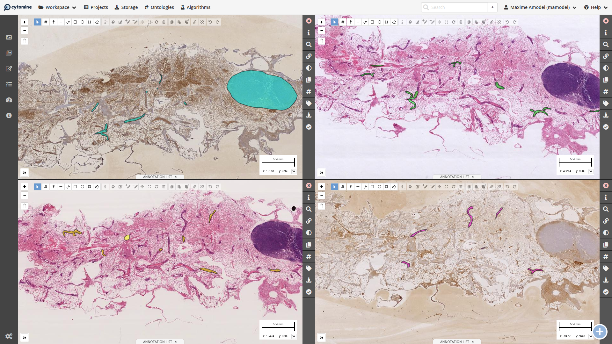
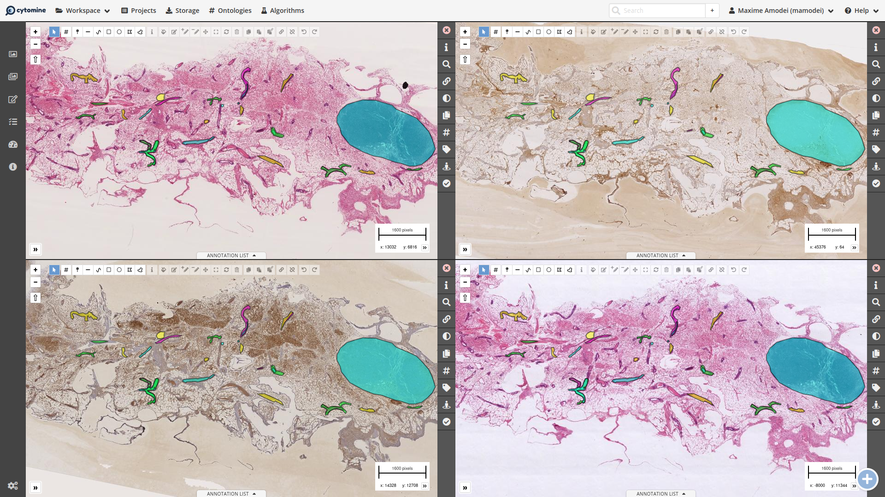
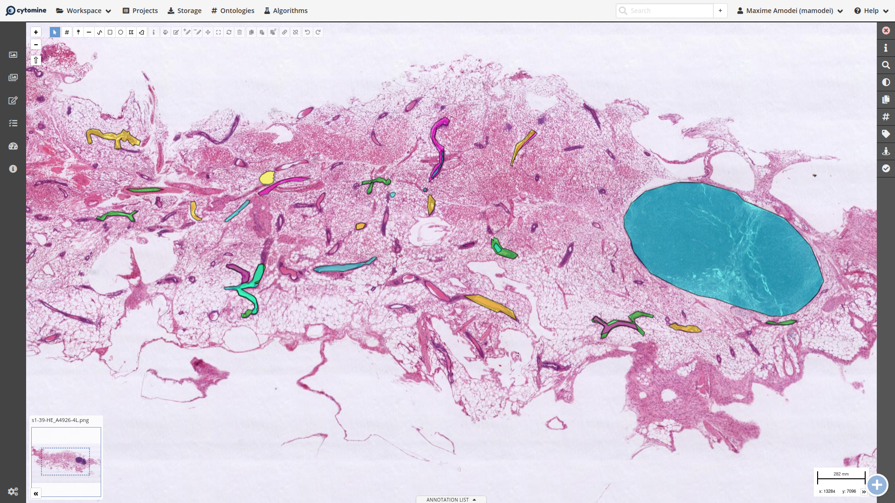
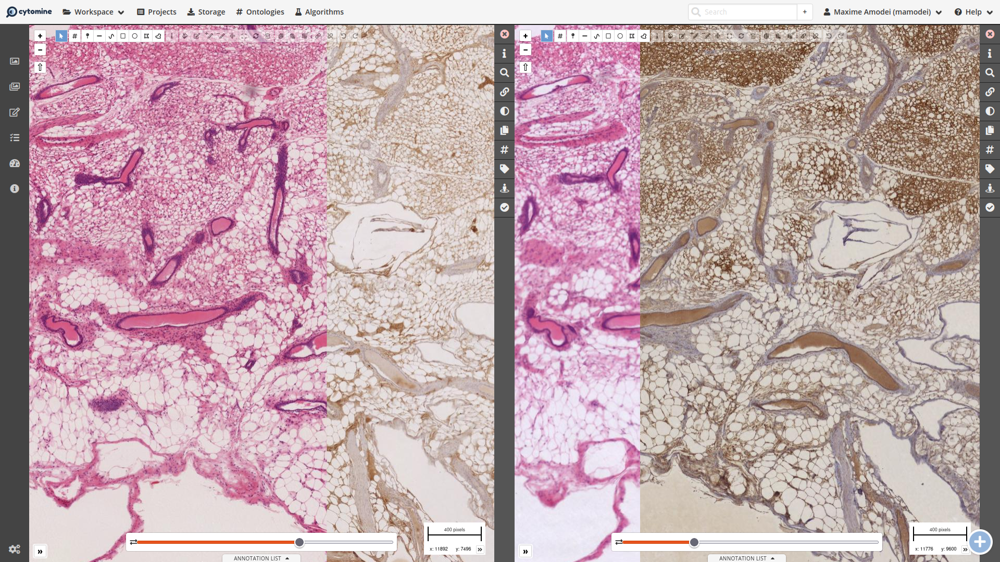
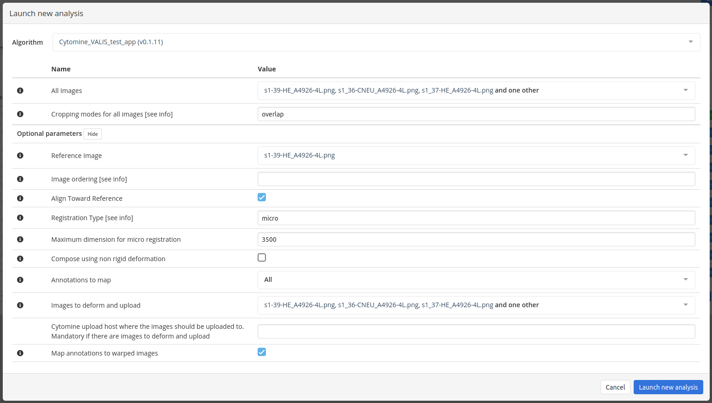

# S_Cytomine_VALIS_test_app

Cytomine (<https://cytomine.org>) demo app developed by ULiège Cytomine Research team (<https://uliege.cytomine.org>) for image registration, using the VALIS (Virtual Alignment of pathoLogy Image Series ) library (<https://github.com/MathOnco/valis>) by [Gatenbee et al. 2021](https://www.biorxiv.org/content/10.1101/2021.11.09.467917v1).

This implementation follows Cytomine (=v3.0) external app conventions based on container technology.

The registration algorithm is implemented by VALIS (see <https://valis.readthedocs.org>).

If you want to learn more about Cytomine App, refer to <https://doc.uliege.cytomine.org/dev-guide/algorithms/>.

## Features

With this Cytomine App, you can deform images and map annotations without leaving the Cytomine UI.
Below is an example using 4 images from the ANHIR (see <https://anhir.grand-challenge.org/>) dataset.

Before registration | After registration
:------------------:|:-----------------:
 | 

You can also view the annotations in the original reference image (see below).

And compare the deformed images side to side.

## Parameters description

The following parameters can tweak your VALIS run. Only the first two (`all_images` and `image_crop`) are mandatory.

### All Images (`all_images`)

All Images that will be registered to or toward the reference image (may or may not include the reference image). If the `reference_image` is not included, it will be added automatically.

VALIS supports the registration of more than two images, which is useful to construct a 3D stack of multiples 2D images.

### Cropping modes for all images (`image_crop`)

How to define the registration domain relative to all images. One of:

- 'overlap' (means the common area only),
- 'reference' (defines the reference image as the domain),
- 'all' (means the smallest area to include all images).

### Reference Image (`reference_image`)

The reference image (or fixed image in other terminologies) is the image for which there is no deformation. This setting is useful when performing registration on two images.

If not given, it will be selected as the median item of the list of images (see `image_ordering`).

### Image ordering (`image_ordering`)

How to order the images before doing the registration, which is useful for 3D registration.
One of:

- 'auto' : (default) meaning that the order doesn't matter,
- 'name' : to be ordered by filename,
- 'created' : to be ordered by addition date to Cytomine.

When 'auto' (or not set), VALIS will optimally order the images based on feature similarity, and thus improve the results when `align_toward_reference` is true.

### Align Toward Reference (`align_toward_reference`)

When dealing with more than two images, such as 3D stack reconstruction, it can be useful to register images to their neighbor, rather than to a common fixed images. When this setting is true (or unset), the images are registered toward the reference, rather than to the reference.

- If false, all images are registered to the reference image, in any order.
- If true (default), the images next to the reference images are registered to the reference. Then the non-registered images next to those images are registered to the previous images, and so on.

### Registration Type (`registration_type`)

The type of registration performed by VALIS. One of

- 'rigid' : using affine transformations on lower resolution versions,
- 'non-rigid' : using non-rigid deformations on lower resolution version,
- 'micro' : using non-rigid deformations on higher resolution. The resolution is higher than non-rigid, but may be lower than the original resolution (see below).

The resolution of the images used for registration is dictated by the defaults of VALIS. When using the 'micro' registration, it is possible to set the resolution used (see `micro_reg_max_dim_px`).

### Maximum dimension for micro registration (`micro_reg_max_dim_px`)

Maximum dimension (in pixel) for any image during the micro registration step. **It is an error to specify this value if registration_type is not 'micro'.**

### Compose  using non-rigid deformation (`compose_non_rigid`)

See VALIS documentation for more info.

### Annotations to map (`annotation_to_map`)

Annotations that should be mapped to the reference image after registration. While it is possible to give annotation that are not in any of the selected images (see `all_images`), the job will fail when doing so. Annotations that are defined in the reference image will not be duplicated.

### Images to deform and upload (`images_to_warp`)

All Images that should be deformed to match the reference and uploaded to the same project. **Must also specify `cytomine_upload_host` if there are images to deform and upload.**

### Cytomine upload host (`cytomine_upload_host`)

Cytomine upload host where the images should be uploaded to. Mandatory if there are images to deform and upload. *If you don't know this domain, ask your system administrator*.

### Map annotations to warped images (`map_annotations_to_warped_images`)

In addition to the reference image, also map annotation to the deformed and uploaded images.
This setting has no effect if `images_to_warp` is an empty list.

## Parameters In the Cytomine UI

The parameters are tunable from the Cytomine App UI, as shown below.

## Possible improvements

- [ ] It is possible to map annotations from any image to any (non-registered) images. Although that is not accessible from the UI.
- [ ] Add a setting to map all human annotations from the source images
- [ ] Select some image group to assess the evaluate the quality of mapping from VALIS
- [ ] Support for multimodal registration

## Versions used

- Cytomine python client: v2.8.3
- VALIS: v1.0.0rc11
